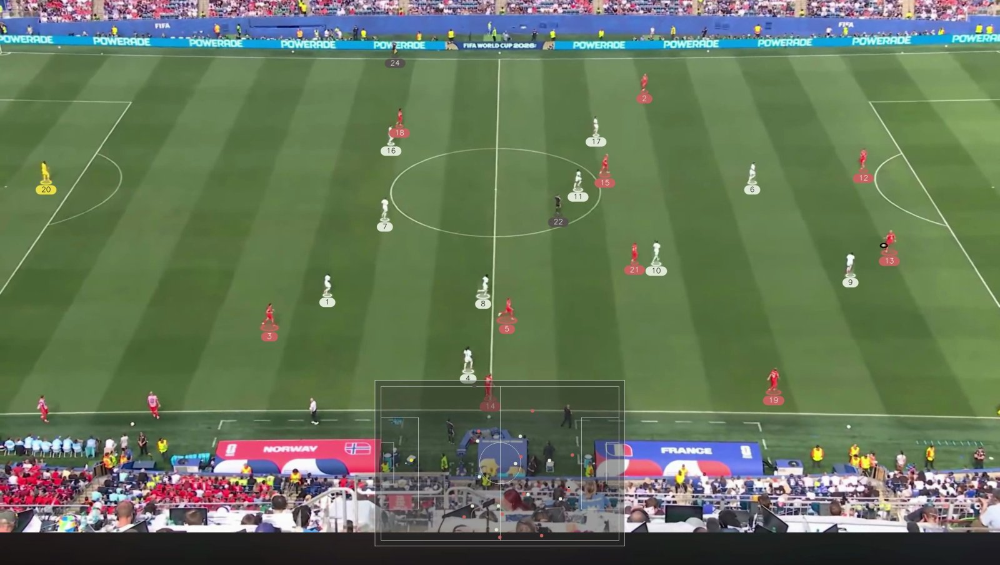

# Football CV Tracker

Turn a tactical-camera football clip into an annotated video and per-frame pitch
positions for every player and the ball.



## What you get

- **`demo.mp4`:** your footage with each player marked at their feet in their kit
  colour and numbered, the ball ringed where it was detected, and a see-through
  minimap of everyone's position on the pitch.
- **Positions in metres:** every player and the ball, per frame (`positions.csv`,
  `ball_positions.csv`).
- **Teams and roles:** each player's team, plus goalkeepers and referees, worked out
  from kit colour and position. You don't have to supply the colours.
- **Possession:** per frame, which team, the keeper or nobody has the ball, plus a
  top-down radar video.

## What your footage needs

- **A tactical camera:** high and wide, showing most of the pitch. Broadcast footage
  with close-ups and replays will not work; the detector is trained for this view.
- **No hard cuts** within the clip.
- **Visible pitch markings.** You calibrate by clicking line crossings on a few frames.
- **High resolution, ideally 2.5K or more.** The ball is only 10–15 px across even then.

## Quickstart

Needs Python 3.11+ and [uv](https://docs.astral.sh/uv/).

```bash
uv sync
uv run python scripts/pull_weights.py      # the two detection models

# 1. Probe your clip and write its config; prints the frames to label next.
uv run python scripts/new_clip.py --video data/raw/myclip.mp4

# 2. Click pitch points on those frames (~10 minutes).
uv run python scripts/annotate_pitch_points.py --config configs/myclip.yaml \
    --frames <printed by step 1> --output data/annotations/pitch_points_myclip.json

# 3. Run everything.
uv run python scripts/run_pipeline.py --config configs/myclip.yaml
```

The result lands in `outputs/myclip/demo.mp4`. A 15-second clip takes about 20
minutes on an Apple-silicon Mac, almost all of it in player detection. Re-runs skip
any stage whose outputs already exist.

The full walkthrough is in **[docs/new_clip.md](docs/new_clip.md)**: how to label
frames well, what to do when the calibration check fails, re-running single stages,
and optional settings.

## How it works

```
video ─► calibrate ─► check ─► detect + track players ─► team colours & roles ─┐
                                └─► detect + track ball ─────────────────────────┤
                                                    project to pitch metres ◄────┘
                                                    ├─► possession, radar
                                                    └─► demo.mp4
```

- **Calibrate:** your clicked points fix the camera-to-pitch mapping on a few frames;
  camera motion carries it to every other frame.
- **Check:** each labelled frame is held out and predicted from the rest. The run
  stops if the median error is over 0.5 m.
- **Players:** a YOLO11 detector fine-tuned on tactical footage, tracked with
  BoxMOT. Detections off the pitch (crowd, benches) are discarded.
- **Team colours and roles:** kit colours are clustered into two teams. Players
  matching neither team are goalkeepers if they stay in a goal area, otherwise
  referees.
- **Ball:** a separate ball-only detector, then a tracker that links detections into
  a path and fills short gaps.
- **Project and render:** everything is mapped to pitch metres for possession, the
  radar and the minimap.

## How well it works

Measured during development on four clips: three from one match and one from an
unseen second match. The labels and evaluation harness don't ship, so these numbers
can't be reproduced from the repo. They are internal measurements, not a benchmark,
and shouldn't be compared with published leaderboards.

| | result |
|---|---|
| calibration, held-out median error | **0.27–0.42 m** on all four clips (stop threshold 0.5 m) |
| identity switches on the labelled clip | **0** over 500 frames, 24 players |
| identity kept through players crossing | 6 of 6 crossings observed, all between opposite teams |
| ball tracked within 10 px, held-out frames | **78%**: 87–100% on the ground, 39–50% in the air |
| possession accuracy | 100%, but the labelled clip contains only one change of possession |
| unseen match | calibration 0.27 m; a red keeper (a kit colour seen in no other clip) found by position |

## Limitations

- **Tactical camera only.**
- **Tested on one unseen match.** Other stadiums, camera heights and frame rates are
  untested.
- **The ball in the air** is found far less reliably than on the ground.
- **Kits close to grey** are drawn in a colour hard to tell from the grey used for
  unclassified players.
- **Fluorescent yellow-green referee kits** can be mistaken for grass and left
  unclassified.
- **Referees on the far side** are sometimes assigned to a team.
- **Lost tracks** come back with a new number.
- **On a low camera** the minimap can cover the near touchline.
- **Two players in the same kit crossing** has not been tested.

## Project layout

```
src/football_tracker/
├── io/           video decoding and letterbox cropping
├── detection/    player, keeper, referee and ball detection
├── homography/   pitch calibration, the calibration check, pitch mask
├── tracking/     player tracker, ball tracker, video annotation
├── reid/         kit colours, teams and roles, track stitching
├── projection/   pitch coordinates, possession, radar and minimap
└── pipeline/     the stage graph and new-clip onboarding
scripts/          command-line entry points (run_pipeline.py drives the rest)
weights/          manifest.json: which models, where to download them, checksums
docs/             new_clip.md, the full walkthrough
tests/            unit tests
```

## Development

```bash
uv run pytest                  # no footage or model weights needed
uv run ruff check . && uv run ruff format --check .
uv run pre-commit install      # lint and format on every commit
```

## Acknowledgements

Built on [Ultralytics YOLO11](https://github.com/ultralytics/ultralytics),
[BoxMOT](https://github.com/mikel-brostrom/boxmot),
[supervision](https://github.com/roboflow/supervision) and
[OpenCV](https://opencv.org/). The detector's base model was trained on Roboflow's
[football-players-detection](https://universe.roboflow.com/roboflow-jvuqo/football-players-detection-3zvbc)
dataset.

## License

[AGPL-3.0-or-later](LICENSE). The detection models are fine-tuned from Ultralytics
YOLO11 weights, and the pipeline runs on the `ultralytics` package; both are
AGPL-3.0, so this project is too.
